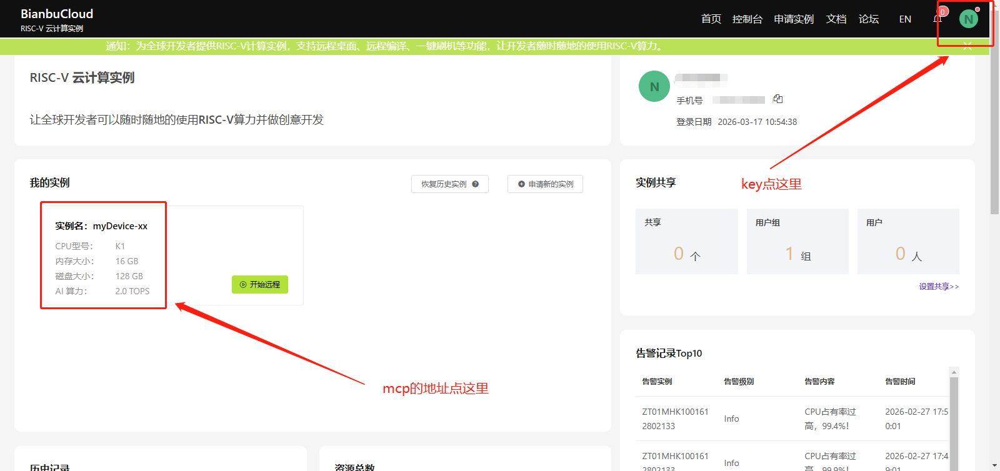
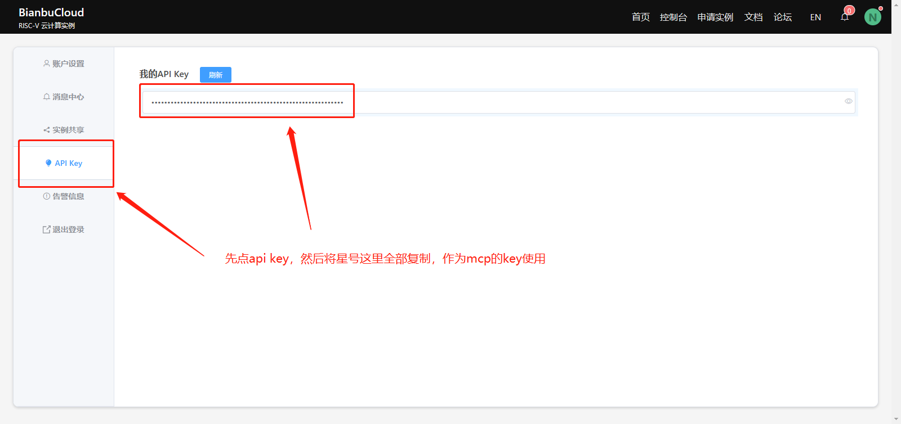
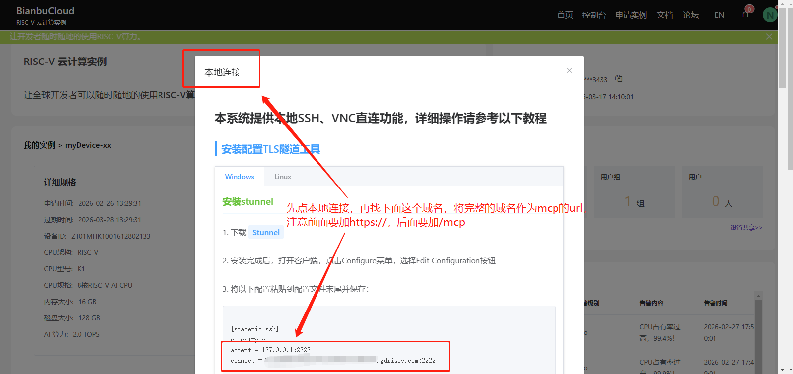

# Bianbu MCP Proxy

<p align="center">
  <b>Expose a Bianbu OS host as a remote MCP server over HTTP/HTTPS.</b>
</p>

<p align="center">
  English | <a href="./README.zh-CN.md">简体中文</a>
</p>

## Overview

This project gives you:

- one-file deployment on a Bianbu OS / Debian-like host
- stateless Streamable HTTP MCP server suitable for platform gateways
- file operations, binary upload/download, and command execution
- optional root-capable MCP calls through `as_root: true`
- auto `sudo` setup for the runtime user during bootstrap
- systemd service with health checks and recovery commands
- client-side pacing and retry examples for rate-limited gateways

## Repository contents

- `bianbu_agent_proxy.sh` — deploy, repair, recover, and manage the remote MCP service
- `examples/client/` — minimal Node client examples for normal and root-capable usage
- `pic/` — screenshots showing where users obtain the remote MCP URL and API key

## Quick start

On the remote Bianbu OS host:

```bash
bash bianbu_agent_proxy.sh
```

The script defaults to `up`, which runs the full recovery/bootstrap flow.

If the file may have CRLF line endings, this also works:

```bash
tr -d '\r' < bianbu_agent_proxy.sh | bash
```

## Commands

```bash
bash bianbu_agent_proxy.sh up
bash bianbu_agent_proxy.sh bootstrap
bash bianbu_agent_proxy.sh repair
bash bianbu_agent_proxy.sh recover
bash bianbu_agent_proxy.sh status
bash bianbu_agent_proxy.sh logs
bash bianbu_agent_proxy.sh show-config
```

Quick meaning:

| Command | Meaning |
|---|---|
| `up` | default full recovery path |
| `bootstrap` | install and deploy from scratch |
| `repair` | re-enable and restart the service, then wait for health |
| `recover` | full rebuild/recovery |
| `status` | show systemd service status |
| `logs` | show service logs |

## Deployment behavior

During bootstrap the script will:

- install `nodejs`, `npm`, `curl`, `ca-certificates`, `python3`, `sudo`
- generate the MCP server app under `/opt/bianbu-mcp-server`
- install dependencies
- configure a systemd service
- enable startup on boot
- configure passwordless sudo for the runtime user when `ENABLE_PASSWORDLESS_SUDO=true`
- wait for `http://127.0.0.1:$PORT/health` before declaring success

Important:

- if you are not root, the script uses `sudo`
- the user must already have sudo rights on the remote machine
- the script cannot bootstrap a machine where the current user has no sudo access at all

## Client configuration

For normal client usage you only need:

- remote MCP URL
- gateway `X-API-KEY`

Example:

```bash
export MCP_SERVER_URL='https://your-domain.example.com/mcp'
export MCP_GATEWAY_KEY='your-x-api-key'
```

## AI IDE setup

For almost all MCP-capable IDEs, the connection details are just:

- transport: HTTP or Streamable HTTP
- URL: `https://your-domain.example.com/mcp`
- header name: `X-API-KEY`
- header value: your gateway key

If an IDE insists on a local executable `command`, that IDE expects a local stdio MCP server and cannot use this remote HTTP endpoint directly.

### Cursor

Typical config location:
- macOS: `~/Library/Application Support/Cursor/User/globalStorage/anysphere.cursor/mcp.json`
- Windows: `%APPDATA%/Cursor/User/globalStorage/anysphere.cursor/mcp.json`
- Linux: `~/.config/Cursor/User/globalStorage/anysphere.cursor/mcp.json`

```json
{
  "mcpServers": {
    "bianbu": {
      "type": "http",
      "url": "https://your-domain.example.com/mcp",
      "headers": {
        "X-API-KEY": "your-x-api-key"
      }
    }
  }
}
```

### Windsurf

Typical config location:
- macOS: `~/Library/Application Support/Windsurf/User/globalStorage/codeium.windsurf/mcp.json`
- Windows: `%APPDATA%/Windsurf/User/globalStorage/codeium.windsurf/mcp.json`
- Linux: `~/.config/Windsurf/User/globalStorage/codeium.windsurf/mcp.json`

Use the same JSON structure as Cursor.

### Claude Desktop

Typical config location:
- macOS: `~/Library/Application Support/Claude/claude_desktop_config.json`
- Windows: `%APPDATA%/Claude/claude_desktop_config.json`

If your build supports remote MCP, use the same URL + header format.

### Cline / Roo Code / VS Code MCP clients

Common config locations:
- `.vscode/settings.json`
- extension-specific MCP settings UI
- extension-specific JSON files under VS Code user data

If the extension supports remote HTTP MCP, use the same server definition. If it only supports local stdio MCP, it cannot use this endpoint directly.

### Continue / Claude Code / Codex-style runners

If the tool supports remote MCP registration, use the same URL + header pattern. If it only supports local command-based MCP, it needs a local bridge.

## How users obtain the MCP URL and key

The `pic/` directory contains the UI flow.

### ① Open the instance page to find the MCP host



The instance page is where users enter the device details page.

### ② Open API Key and copy the key value



Users should open the `API Key` page and copy the full key value. This becomes the `X-API-KEY` used by MCP clients.

### ③ Open Local Connection and derive the MCP URL



Users should open `Local Connection`, find the full domain, and build the MCP endpoint as:

```text
https://<that-domain>/mcp
```

In short:

- MCP URL = `https://<domain>/mcp`
- MCP key = the value shown in `API Key`

## Exposed MCP tools

- `health`
- `list_directory`
- `read_text_file`
- `write_text_file`
- `upload_binary_file`
- `download_binary_file`
- `make_directory`
- `delete_path`
- `run_command`

## Root-capable operations

Most tools accept:

```json
{
  "as_root": true
}
```

Supported for:
- `list_directory`
- `read_text_file`
- `write_text_file`
- `upload_binary_file`
- `download_binary_file`
- `make_directory`
- `delete_path`
- `run_command`

Read a root-owned file:

```json
{
  "name": "read_text_file",
  "arguments": {
    "path": "/root/secret.txt",
    "max_bytes": 8192,
    "encoding": "utf-8",
    "as_root": true
  }
}
```

Run a root shell command:

```json
{
  "name": "run_command",
  "arguments": {
    "command": "id && whoami",
    "cwd": "/",
    "timeout_seconds": 30,
    "as_root": true
  }
}
```

## Recommended gateway pacing

Some gateways reject bursty traffic. Recommended stable defaults:

```bash
export MCP_MIN_INTERVAL_MS=1000
export MCP_MAX_RETRIES=2
export MCP_RETRY_BASE_MS=1000
```

That is about 1 request per second, optimized for stability.

## Local client examples

In `examples/client/`:

```bash
npm install
npm run test:stateless
npm run test:root
```

Expected env vars:
- `MCP_SERVER_URL`
- `MCP_GATEWAY_KEY`

## Health and troubleshooting

Remote health check:

```bash
curl http://127.0.0.1:11434/health
```

Useful commands:

```bash
bash bianbu_agent_proxy.sh status
bash bianbu_agent_proxy.sh logs
bash bianbu_agent_proxy.sh repair
bash bianbu_agent_proxy.sh recover
```

If the script file was uploaded from Windows and line endings are broken:

```bash
tr -d '\r' < bianbu_agent_proxy.sh | bash
```

## Security notes

- gateway authentication is expected to be enforced outside the script via `X-API-KEY`
- the proxy itself does not add a second auth token layer by default
- `as_root: true` is powerful and should only be exposed behind a trusted gateway
- enabling passwordless sudo for the runtime user is a deliberate tradeoff to support remote root-capable MCP operations

## License

MIT
